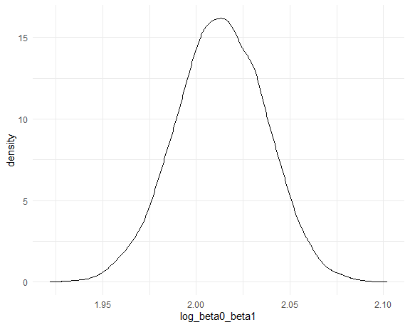

p8105_hw6_jz3902
================
Jinghan Zhao
2024-11-23

## Problem 1

Importing data.

``` r
weather_df = 
  rnoaa::meteo_pull_monitors(
    c("USW00094728"),
    var = c("PRCP", "TMIN", "TMAX"), 
    date_min = "2017-01-01",
    date_max = "2017-12-31") %>%
  mutate(
    name = recode(id, USW00094728 = "CentralPark_NY"),
    tmin = tmin / 10,
    tmax = tmax / 10) %>%
  select(name, id, everything())
```

Writing functions to extract $\hat{r}^2$ and generate
$log(\hat{\beta_0} * \hat{\beta_1})$.

``` r
r_squared = function (input_fit){
  
  r_squared = 
    input_fit %>% 
    broom::glance() %>% 
    pull(r.squared)
  
  return(r_squared)
}
```

``` r
log_beta = function (input_fit){
  
  beta_0 = 
    input_fit %>% 
    broom::tidy() %>% 
    filter(term == "(Intercept)") %>% 
    pull(estimate)
  
  beta_1 = 
    input_fit %>% 
    broom::tidy() %>% 
    filter(term == "tmin") %>% 
    pull(estimate)
  
  log_beta0_beta1 = log(beta_0 * beta_1)
  
  return(log_beta0_beta1)
}
```

Doing bootstrapping and produce the two quantities.

``` r
boot_straps = 
  weather_df %>% 
  bootstrap(5000) %>% 
  mutate(
    strap = map(strap, as_tibble),
    models = map(strap, \(df) lm(tmax ~ tmin, data = df)),
    r_squared = map(models, \(fit) r_squared(input_fit = fit)),
    log_beta0_beta1 = map(models, \(fit) log_beta(input_fit = fit))
  ) %>% 
  select(.id, r_squared, log_beta0_beta1) %>% 
  unnest(c(r_squared, log_beta0_beta1))
```

### $\hat{r}^2$: Distribution and CI

``` r
boot_straps %>% 
  ggplot(aes(x = r_squared)) +
  geom_density()
```


``` r
boot_straps %>% 
  select(r_squared) %>% 
  t.test(conf.level = 0.95) %>% 
  broom::tidy() %>% 
  select(conf.low, conf.high)
```

    ## # A tibble: 1 × 2
    ##   conf.low conf.high
    ##      <dbl>     <dbl>
    ## 1    0.911     0.912

The distribution of $\hat{r}^2$ is approximately normal and slightly
left-skewed. This skewness may be caused by the randomness of sampling.

### $log(\hat{\beta_0} * \hat{\beta_1})$: Distribution and CI

``` r
boot_straps %>% 
  ggplot(aes(x = log_beta0_beta1)) +
  geom_density()
```



``` r
boot_straps %>% 
  select(log_beta0_beta1) %>% 
  t.test(conf.level = 0.95) %>% 
  broom::tidy() %>% 
  select(conf.low, conf.high)
```

    ## # A tibble: 1 × 2
    ##   conf.low conf.high
    ##      <dbl>     <dbl>
    ## 1     2.01      2.01

The distribution of $log(\hat{\beta_0} * \hat{\beta_1})$ is
approximately normal.
