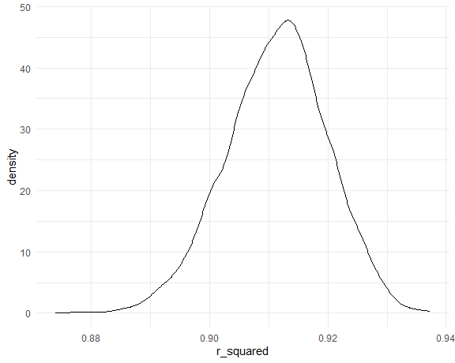
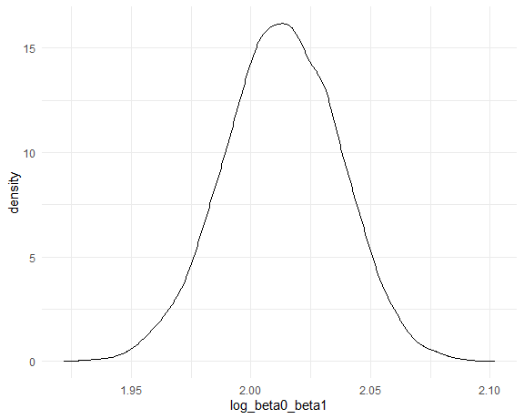
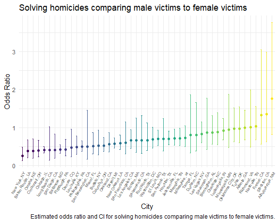
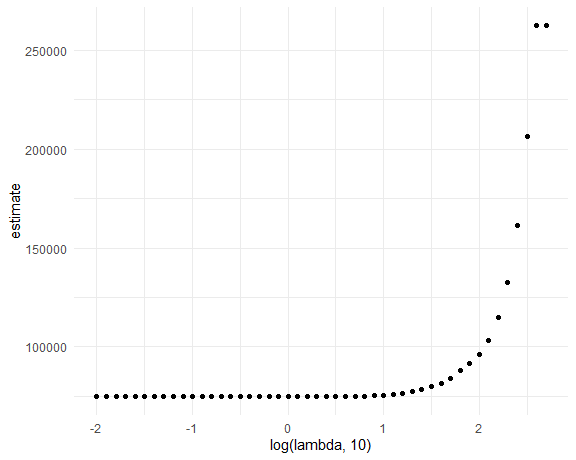
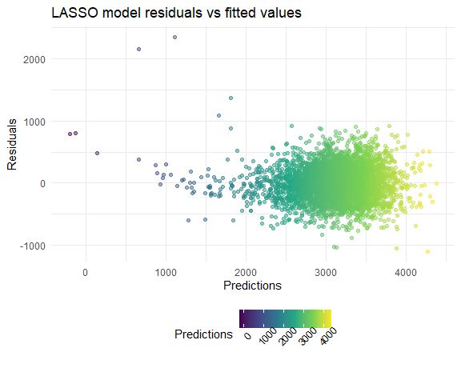
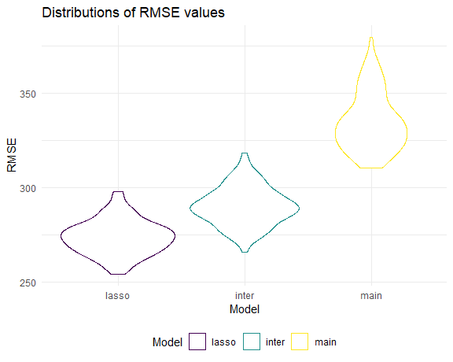

p8105_hw6_jz3902
================
Jinghan Zhao
2024-11-23

## Problem 1

Importing data.

``` r
weather_df = 
  rnoaa::meteo_pull_monitors(
    c("USW00094728"),
    var = c("PRCP", "TMIN", "TMAX"), 
    date_min = "2017-01-01",
    date_max = "2017-12-31") %>%
  mutate(
    name = recode(id, USW00094728 = "CentralPark_NY"),
    tmin = tmin / 10,
    tmax = tmax / 10) %>%
  select(name, id, everything())
```

Writing functions to extract $\hat{r}^2$ and generate
$log(\hat{\beta_0} * \hat{\beta_1})$.

``` r
r_squared = function (input_fit){
  
  r_squared = 
    input_fit %>% 
    broom::glance() %>% 
    pull(r.squared)
  
  return(r_squared)
}
```

``` r
log_beta = function (input_fit){
  
  beta_0 = 
    input_fit %>% 
    broom::tidy() %>% 
    filter(term == "(Intercept)") %>% 
    pull(estimate)
  
  beta_1 = 
    input_fit %>% 
    broom::tidy() %>% 
    filter(term == "tmin") %>% 
    pull(estimate)
  
  log_beta0_beta1 = log(beta_0 * beta_1)
  
  return(log_beta0_beta1)
}
```

Doing bootstrapping and produce the two quantities.

``` r
boot_straps = 
  weather_df %>% 
  bootstrap(5000) %>% 
  mutate(
    strap = map(strap, as_tibble),
    models = map(strap, \(df) lm(tmax ~ tmin, data = df)),
    r_squared = map(models, \(fit) r_squared(input_fit = fit)),
    log_beta0_beta1 = map(models, \(fit) log_beta(input_fit = fit))
  ) %>% 
  select(.id, r_squared, log_beta0_beta1) %>% 
  unnest(c(r_squared, log_beta0_beta1))
```

### $\hat{r}^2$: Distribution and CI

``` r
boot_straps %>% 
  ggplot(aes(x = r_squared)) +
  geom_density()
```



``` r
boot_straps %>% 
  select(r_squared) %>% 
  t.test(conf.level = 0.95) %>% 
  broom::tidy() %>% 
  select(conf.low, conf.high)
```

    ## # A tibble: 1 × 2
    ##   conf.low conf.high
    ##      <dbl>     <dbl>
    ## 1    0.911     0.912

The distribution of $\hat{r}^2$ is approximately normal and slightly
left-skewed. This skewness may be caused by the randomness of sampling.

### $log(\hat{\beta_0} * \hat{\beta_1})$: Distribution and CI

``` r
boot_straps %>% 
  ggplot(aes(x = log_beta0_beta1)) +
  geom_density()
```



``` r
boot_straps %>% 
  select(log_beta0_beta1) %>% 
  t.test(conf.level = 0.95) %>% 
  broom::tidy() %>% 
  select(conf.low, conf.high)
```

    ## # A tibble: 1 × 2
    ##   conf.low conf.high
    ##      <dbl>     <dbl>
    ## 1     2.01      2.01

The distribution of $log(\hat{\beta_0} * \hat{\beta_1})$ is
approximately normal.

## Problem 2

``` r
homicide_df = 
  read_csv("data/homicide-data.csv") %>% 
  mutate(
    city_state = str_c(city, state, sep = ", "),
    resolved = as.numeric(disposition == "Closed by arrest"),
    victim_age = as.numeric(victim_age)
    ) %>% 
  filter(
    !city_state %in% c("Dallas, TX", "Phoenix, AZ", "Kansas City, MO", "Tulsa, AL"),
    victim_race %in% c("White", "Black")
  )
```

### Baltimore: Logistic regression

``` r
fit_baltimore = 
  homicide_df %>% 
  filter(city_state == "Baltimore, MD") %>% 
  glm(resolved ~ victim_age + victim_sex + victim_race, data = ., family = binomial()) 

fit_baltimore %>% 
  broom::tidy()
```

    ## # A tibble: 4 × 5
    ##   term             estimate std.error statistic  p.value
    ##   <chr>               <dbl>     <dbl>     <dbl>    <dbl>
    ## 1 (Intercept)       0.310     0.171        1.81 7.04e- 2
    ## 2 victim_age       -0.00673   0.00332     -2.02 4.30e- 2
    ## 3 victim_sexMale   -0.854     0.138       -6.18 6.26e-10
    ## 4 victim_raceWhite  0.842     0.175        4.82 1.45e- 6

``` r
fit_baltimore %>% 
  broom::tidy(conf.int = TRUE, exponentiate = TRUE) %>% 
  filter(term == "victim_sexMale") %>% 
  select(term, estimate, conf.low, conf.high) %>% 
  rename(odds_ratio = estimate)
```

    ## # A tibble: 1 × 4
    ##   term           odds_ratio conf.low conf.high
    ##   <chr>               <dbl>    <dbl>     <dbl>
    ## 1 victim_sexMale      0.426    0.324     0.558

Use `exponentiate = TRUE` to compute odds ratio.

Homicides in which the victim is male are significantly less likely to
be resolved than those in which the victim is female.

### All cities: Logistic regression

``` r
fit_cities = 
  homicide_df %>% 
  select(city_state, resolved, victim_age, victim_sex, victim_race) %>% 
  filter(victim_sex %in% c("Male", "Female")) %>% 
  nest(data = resolved:victim_race) %>% 
  mutate(
    models = map(data, \(df) glm(resolved ~ victim_age + victim_sex + victim_race, 
                                 data = df, family = binomial())),
    results = map(models, \(x) broom::tidy(x = x, conf.int = TRUE, exponentiate = TRUE))
  ) %>% 
  select(city_state, results) %>% 
  unnest(results) %>% 
  rename(odds_ratio = estimate)

fit_cities %>% 
  filter(term == "victim_sexMale") %>% 
  mutate(city_state = fct_reorder(city_state, odds_ratio)) %>% 
  ggplot(aes(x = city_state, y = odds_ratio, color = city_state)) +
  geom_point() +
  geom_errorbar(aes(ymin = conf.low, ymax = conf.high), width = 0.2) +
  labs(
    title = "Solving homicides comparing male victims to female victims",
    x = "City",
    y = "Odds Ratio",
    caption = "Estimated odds ratio and CI for solving homicides comparing male victims to female victims.") +
  theme(legend.position = "none",
        axis.text.x = element_text(size = 6, angle = 60, hjust = 1))
```



- For most cities in the dataset, homicides in which the victim is male
  are less or similarly likely to be resolved than those in which the
  victim is female.

- For Fresno, CA, Stockton, CA and Albuquerque, NM, the estimated odds
  ratios are greater than 1, while the confidence intervals still
  include 1, meaning that we do not have enough evidence to conclude
  that homicides with male victims are more likely to be resolved than
  homicides with female victims.

## Problem 3

Loading and cleaning the data.

``` r
birthweight_df = 
  read_csv("data/birthweight.csv") %>% 
  mutate(
    babysex = 
        case_match(babysex,
            1 ~ "male",
            2 ~ "female"
        ),
    babysex = fct_infreq(babysex),
    frace = 
        case_match(frace,
            1 ~ "white",
            2 ~ "black", 
            3 ~ "asian", 
            4 ~ "puerto rican", 
            8 ~ "other"),
    frace = fct_infreq(frace),
    mrace = 
        case_match(mrace,
            1 ~ "white",
            2 ~ "black", 
            3 ~ "asian", 
            4 ~ "puerto rican",
            8 ~ "other"),
    mrace = fct_infreq(mrace),
    malform = as.logical(malform))

birthweight_df %>% 
  is.na() %>% 
  sum()
```

    ## [1] 0

### LASSO model

Preparing for lasso:

- Write a function to create predictor matrix

- Create variables: predictor matrix `x` and outcome vector `y`

``` r
x_matrix = function(df){
  
  x = model.matrix(bwt ~ ., df)[,-1]
  
  return(x)
}

x = x_matrix(birthweight_df)
y = birthweight_df %>%  pull(bwt)
```

Cross validation: find the optimal lambda value.

``` r
lambda = 10^(seq(-2, 2.75, 0.1))

lasso_cv = cv.glmnet(x, y, lambda = lambda)

lasso_cv |> 
  broom::tidy() |> 
  ggplot(aes(x = log(lambda, 10), y = estimate)) + 
  geom_point()  
```



``` r
lambda_opt = lasso_cv[["lambda.min"]]
```

Fitting a lasso model with optimal lambda.

``` r
lasso_fit = glmnet(x, y, lambda = lambda_opt)

lasso_fit %>% 
  broom::tidy()
```

    ## # A tibble: 17 × 5
    ##    term               step  estimate lambda dev.ratio
    ##    <chr>             <dbl>     <dbl>  <dbl>     <dbl>
    ##  1 (Intercept)           1 -6036.      1.58     0.718
    ##  2 babysexfemale         1    25.2     1.58     0.718
    ##  3 bhead                 1   130.      1.58     0.718
    ##  4 blength               1    74.9     1.58     0.718
    ##  5 delwt                 1     1.39    1.58     0.718
    ##  6 fincome               1     0.274   1.58     0.718
    ##  7 fracepuerto rican     1   -47.7     1.58     0.718
    ##  8 gaweeks               1    11.3     1.58     0.718
    ##  9 menarche              1    -2.41    1.58     0.718
    ## 10 mheight               1     6.47    1.58     0.718
    ## 11 momage                1     0.419   1.58     0.718
    ## 12 mraceblack            1  -134.      1.58     0.718
    ## 13 mracepuerto rican     1   -47.9     1.58     0.718
    ## 14 mraceasian            1   -55.1     1.58     0.718
    ## 15 parity                1    80.0     1.58     0.718
    ## 16 smoken                1    -4.55    1.58     0.718
    ## 17 wtgain                1     2.59    1.58     0.718

Plot of residuals against fitted values.

``` r
birthweight_df %>%
  mutate(
    predictions = predict(lasso_fit, 
                          newx = x_matrix(.),
                          s = lambda_opt),
    residuals = bwt - predictions
  ) %>% 
  ggplot(aes(x = predictions, y = residuals, color = predictions)) +
  geom_point(alpha = .5) +
  labs(
    title = "LASSO model residuals vs fitted values",
    x = "Predictions",
    y = "Residuals",
    color = "Predictions") +
  theme(legend.text = element_text(angle = 45))
```



### Model comparison

The three models:

1)  `lasso_mod`: a data-driven model-building process

2)  `main_mod`: using length at birth and gestational age as predictors
    (main effects only)

3)  `inter_mod`: using head circumference, length, sex, and all
    interactions (including the three-way interaction) between these

Doing cross-validation with map.

``` r
cv_df = 
  crossv_mc(birthweight_df, 100) %>% 
  mutate(
    train = map(train, as_tibble),
    test = map(test, as_tibble)
  )

cv_res_df = 
  cv_df %>% 
  mutate(
    lasso_mod = map(train, \(df) glmnet(x = x_matrix(df), y = df$bwt, lambda = lambda_opt)),
    main_mod = map(train, \(df) lm(bwt ~ blength + gaweeks, data = df)),
    inter_mod = map(train, \(df) lm(bwt ~ bhead * blength * babysex, data = df))
  ) %>% 
  mutate(
    lasso_predictions = map2(lasso_mod, test, \(x, y) 
                             predict(x, newx = x_matrix(y), s = lambda_opt)),
    rmse_lasso = map2_dbl(lasso_predictions, test, \(x, y) sqrt(mean((y$bwt - x)^2))),
    rmse_main = map2_dbl(main_mod, test, rmse),
    rmse_inter = map2_dbl(inter_mod, test, rmse)
  )
```

Plotting the distribution of RMSE for each model.

``` r
cv_res_df %>% 
  select(starts_with("rmse")) %>% 
  pivot_longer(
    everything(), 
    names_to = "model",
    values_to = "rmse", 
    names_prefix = "rmse_"
  ) %>% 
  mutate(model = fct_reorder(model, rmse)) %>% 
  ggplot(aes(x = model, y = rmse, color = model)) +
  geom_violin() +
  labs(
    title = "Distributions of RMSE values",
    x = "Model",
    y = "RMSE",
    color = "Model")
```



- For this dataset, the LASSO model appears to be the model with the
  lowest error.

- Although LASSO is more advantageous in smaller dataset, we can still
  observe that its error is lower than other models. Therefore, LASSO
  still has some value for this dataset.
